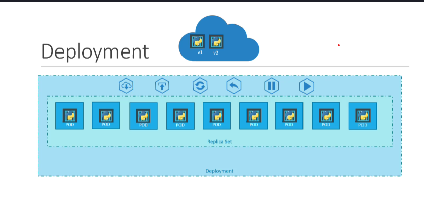

# 1 what is Container orchestration

It is the process of automatically deploying and managing containers. Well known technologies:
Docker swarm, kubernetes or k8 and MESOS.

# 2 kubernetes Concepts

## 2.1 How kubernetes work

**Node** is a machine, physical or virtual on which kubernetes is installed. Node is working machine and that is where containers will be launched by kubernetes.

**Cluster** is a set of Node grouping together. This way even if one node fails you have your application still accessible from other nodes.

**Master** is another node with Kubernetes installed in it and configured as a Master. Master watches over the nodes in the cluster and is reponsible for the actual orchestration of containers on the worker nodes.

## 2.2 Components of kubernetes
Components of kubernetes:

1) API Server : it is the frontend for kubernetes. The users, managemnet devices, command line interfaces all talk to the API server to interact with Kubernetes cluster

2) etcd : distributed reliable key value store used by kubernetes to store all data used to manage the cluster.

3) kubelet : responsible for making sure that the containers are running on the nodes as expected.

4) Container Runtime: 

5) Controller: responsible for noticing and responding when nodes, containers or end points goes down.

6) Scheduler: responsible for distributing work or containers across multiple nodes. Looks for newly created containers and assigns them to nodes.

.png>)

## 2.3 POD

kubernetes does not deploy containers directly on the worker nodes. The containers are encapsulated into a kubernetes object known as pods. A pod is a single instance of an application. The smallest unit of Kubernetes, a pod can run one or more containers.
.png>)

## 2.4 ReplicaSet

- Ensures a specified number of pod replicas are running at all times.
- If a pod crashes or is deleted, the ReplicaSet creates a new one.

## 2.5 Deployment

- Manages ReplicaSets and provides rolling updates and rollbacks.
- Allows declarative updates to applications.
- Ensures zero-downtime updates and self-healing.

A rollout is the process of deploying a new version of an application without disrupting availability. Kubernetes Deployments manage rollouts automatically.

# 3 kubectl: Kubernetes Command-Line Tool

## 3.1 overall

1) View Kubernetes Cluster Info

`kubectl cluster-info`

This shows the endpoint URLs for the Kubernetes control plane and services.
Get All Resources in the Cluster

2) List all resources (pods, replicaSets, services and deployments)

`kubectl get all`

3) Create and Deploy Resources (pods, replicaSets, services and deployments)

`kubectl apply -f <file.yaml>`

4) Delete Resources

Delete a pod, deployment, or service:

`kubectl delete pod <pod-name>`
`kubectl delete replicaset <replicaset-name>`
`kubectl delete deployment <deployment-name>`
`kubectl delete service <service-name>`

5) View Resource Status

Check the status of a deployment, pod, or service:

`kubectl get deployment <deployment-name>`
`kubectl get replicaset <replicaset-name>`
`kubectl get service <service-name>`
`kubectl get pod <pod-name>`

6) edit resources

`kubectl edit deployment <deployment-name>`
`kubectl edit replicaset <replicaset-name>`
`kubectl edit service <service-name>`
`kubectl edit pod <pod-name>`

## 3.2 pods

1) List all pods in the cluster (they contain your application containers):

`kubectl get pods`

2) get Node where each pod is running

`kubectl get pods -o wide`

This will show: Pod name, Ready status, Restart count and Node where each pod is running

3) Get Pod Details

`kubectl describe pod <pod-name>`

4) Check logs for debugging purposes:

`kubectl logs <pod-name>`

For multi-container pods, specify the container:

`kubectl logs <pod-name> -c <container-name>`

## 3.3 replicaset

1) List all replicasets in the cluster

`kubectl get replicasets`

2) Scale the number of replicas for a replicaset:

`kubectl scale --replicas=5 -f <.yml file>` or `kubectl scale --replicas=5 replicaset replicaset-name`

3) Get replicaset Details

`kubectl describe replicaset <replicaset-name>`

## 3.4 Deployments

1) List all deployments in the cluster

`kubectl get deployments`

2) Get deployments Details

`kubectl describe deployment <deployment-name>`

3) check rollout status 

`kubectl rollout status deployment <deployment-name>`

4) check revision history of our deployment

`kubectl rollout history deployment <deployment-name>`

5) Roll back to the previous version

`kubectl rollout undo deployment <deployment-name>`

6) Roll back to a specific version

`kubectl rollout undo deployment <deployment-name> --to-revision=<rev>`	

7) Expose Your Application

Create a service to expose a deployment to the outside world:

`kubectl expose deployment <deployment-name> --type=LoadBalancer --port=80`

